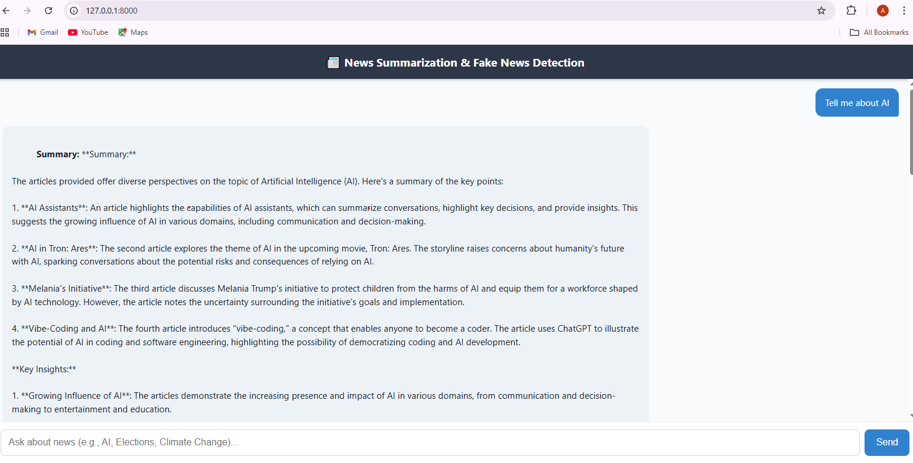

# 📰 Fake News Detection & News Summarization App

An **AI-powered web application** that summarizes the latest news articles and detects potential fake or misleading information using **Generative AI**, **LangChain**, and **HuggingFace** models.  

This project aims to help users **save time**, **stay informed**, and **verify the credibility** of online news using cutting-edge NLP and retrieval-augmented techniques.

---

## 🚀 Features

- 🔍 **News Retrieval:** Fetches the latest news articles based on user queries (e.g., “AI in Healthcare”).  
- 🧠 **News Summarization:** Generates concise, human-like summaries using **Meta Llama-3** (HuggingFace).  
- 🧾 **Fake News Detection:** Uses a fine-tuned NLP model to analyze the **credibility** of each article.  
- ⚡ **Vector Search (FAISS):** Retrieves the most relevant articles efficiently.  
- 🧩 **LangChain Integration:** Chains LLMs and retrieval steps for intelligent response generation.  
- 💬 **FastAPI Backend:** Provides a clean, fast, and scalable API for serving predictions and summaries.  

---

## 🧠 Tech Stack

| Component | Technology Used |
|------------|----------------|
| Backend API | FastAPI |
| Generative AI | LangChain + HuggingFace Transformers |
| Vector Database | FAISS |
| Summarization Model | Meta Llama-3 |
| Fake News Model | HuggingFace (Fine-tuned classifier) |
| Programming Language | Python |
| Deployment | (optional: Streamlit / Render / HuggingFace Spaces) |

---

## ⚙️ How It Works

1. User enters a **news topic or query**.  
2. App fetches the **latest related articles** from online sources.  
3. Articles are embedded and indexed using **FAISS**.  
4. Relevant articles are retrieved and passed to **LangChain**, which:  
   - Summarizes each article using **Meta Llama-3**.  
   - Runs the **Fake News Detection Model** to evaluate authenticity.  
5. Results (summaries + credibility) are returned in a structured format.

---

## 📦 Installation

```bash
# Clone the repository
git clone https://github.com/aliahmad552/fake_news_detection_and_summarization.git
cd fake_news_detection_and_summarization

# Create and activate virtual environment
python -m venv venv
source venv/bin/activate   # On Windows: venv\Scripts\activate

# Install dependencies
pip install -r requirements.txt

# Run FastAPI server
uvicorn app:app --reload


```
---
## 📊 Example Output

Input Query: AI in Healthcare
Output:

📰 Summarized News: AI is transforming healthcare through faster diagnosis and efficient data-driven treatment plans...

🧾 Fake News Probability: Low (92% Reliable)

## 🌍 Future Enhancements

💬 Add Chat-style Frontend UI

📈 Real-time Credibility Dashboard

🌐 Integration with live news APIs

🧠 Fine-tune models for domain-specific detection
---
## 💡 Why This Project?

In a world flooded with information, separating truth from noise has become essential.
This project uses AI for good — helping people consume news intelligently, quickly, and responsibly.
--
## 👨‍💻 Author

Ali Ahmad

Data Scientist | AI Engineer | Generative AI Enthusiast
